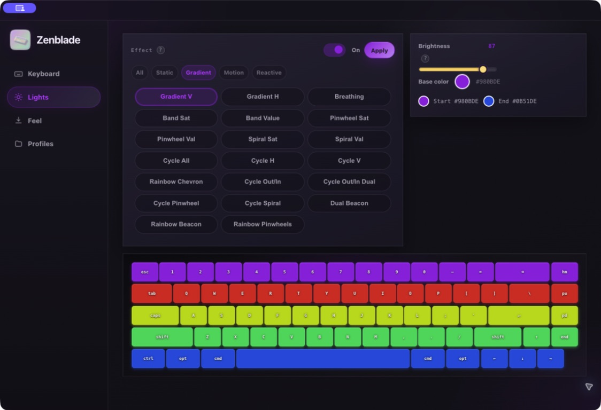
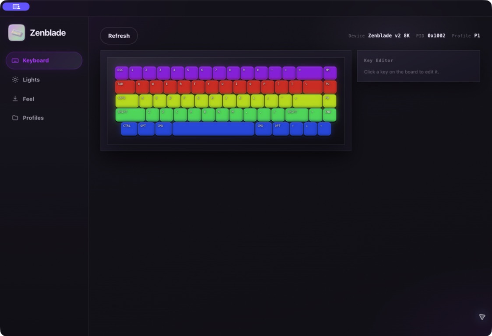
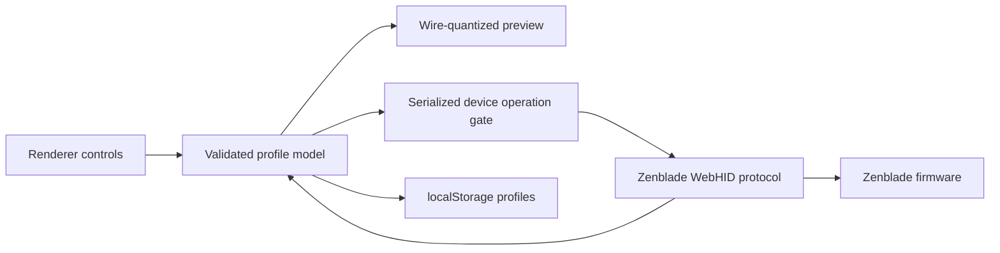

# Zenblade 65 V2 for macOS

A free, open-source macOS controller for the **Pwnage Zenblade 65 V2** keyboard. It provides native lighting, actuation, per-key override, and profile controls without requiring the Windows software.

> This is an independent community project and is not affiliated with or endorsed by Pwnage.



## Features

- Discover and connect supported Zenblade devices through WebHID.
- Select firmware lighting effects, power, brightness, speed, and base color.
- Preview lighting with the same 8-bit hue, saturation, and brightness conversions sent to the keyboard.
- Show the visible start and end colors for horizontal and vertical gradients.
- Configure global press/release points and Rapid Trigger.
- Save press/release overrides for individual keys.
- Keep three local profiles with independent lighting, feel, and per-key settings.
- Browse and edit local settings while the keyboard is disconnected.
- Restore locally saved actuation settings when reconnecting.



The preview represents the exact digital values sent by the app. A monitor and physical LEDs have different color gamuts and calibration, so perfect colorimetric matching between them is not possible.

## Requirements

- An Apple-silicon Mac.
- A recent macOS release.
- Node.js 22.12 or newer (the current LTS release is recommended).
- A Pwnage Zenblade 65 V2 connected over USB.

The HID filters currently accept vendor ID `0x3662` with product IDs `0x1001` and `0x1002`. Unsupported keyboards are not selected automatically.

## Install in Applications

Clone or download the repository, open Terminal in the project directory, and run:

```bash
npm run install-app
```

The installer performs a fresh build, creates a local ad-hoc signature, verifies the bundle, replaces `/Applications/Zenblade.app`, and opens it. Run the same command after pulling future updates.

On first use, macOS may show the filtered HID device picker. Select the Zenblade once; subsequent launches normally reconnect automatically. Use **Device → Reconnect** or the **Refresh** button if needed.

## Build from source

```bash
git clone https://github.com/edgetr/Zenblade-65-V2-MacOS-App.git
cd Zenblade-65-V2-MacOS-App
npm ci
npm test
npm run build
```

The unpacked application is written to:

```text
dist/mac-arm64/Zenblade.app
```

To run directly from the source tree:

```bash
npm start
```

For development with detached Chromium DevTools:

```bash
npm run dev
```

## Using the app

### Lights

1. Choose an effect category and firmware effect.
2. Adjust the controls exposed by that effect.
3. Use the circular color picker for effects that accept a base color.
4. For **Gradient V** and **Gradient H**, check the two endpoint swatches against the keyboard preview.
5. Select **Apply** to write the settings to the keyboard.

The app intentionally omits firmware mode `2` (`Alpha Mods`) because it is not supported by this keyboard. Stored or reported mode-2 values safely fall back to **Solid**; the remaining firmware IDs are not renumbered.

### Feel

- **Press** controls how far a key travels before registering.
- **Release** controls how far it must return before unregistering.
- **Rapid Trigger** allows a key to retrigger as soon as its direction changes.
- **Snappy**, **Balanced**, and **Typing** provide starting points.
- **Apply** writes the complete actuation matrix to the current keyboard profile.

### Keyboard

Select a key in the keyboard diagram to set a press/release override. **Save Key** stores the change locally while disconnected; **Apply Key** stores it and writes the current matrix when connected. **Reset Key** returns it to the profile's global Feel values.

### Profiles

Profiles 1–3 keep separate lighting, Feel, and per-key settings. Switching profiles writes the selected profile and attempts to apply all of its settings. If only part of that operation succeeds, the Profiles page offers a recovery action.

## Architecture

Zenblade is a small Electron application with no renderer framework or production runtime dependencies.

| Area | Main files | Responsibility |
| --- | --- | --- |
| Electron host | `electron/main.js`, `electron/preload.js` | Window lifecycle, macOS menu, external-link handling, HID permission bridge |
| App orchestration | `renderer/js/app.js`, `renderer/js/bootstrap-ui.js` | Connect/disconnect flow, operation gating, navigation, top-level UI synchronization |
| HID protocol | `renderer/js/protocol.js`, `shared/device-ids.json` | Device filtering, command queue, wire packing, lighting/profile/actuation reads and writes |
| State and persistence | `renderer/js/state.js`, `renderer/js/store.js` | Profile model, validation, migration, debounced `localStorage` persistence |
| Lighting | `renderer/js/lighting-modes.js`, `lighting-ui.js`, `lighting-preview.js`, `preview.js` | Fixed firmware IDs, control visibility, wire-quantized colors, effect preview recipes |
| Keyboard and feel | `renderer/js/board.js`, `key-editor.js`, `layout.js`, `device-ops.js` | 67-key layout, responsive rendering, per-key overrides, full actuation matrices |
| Presentation | `renderer/index.html`, `renderer/css/` | Accessible semantic controls and native macOS-oriented visual styling |
| Tests | `test/model.test.js` | Model boundaries, HID packing/matching, mode integrity, preview behavior, regressions |



### Important invariants for contributors and coding agents

- Lighting firmware IDs are wire values. Never renumber them when hiding an unsupported UI option.
- Lighting writes intentionally send both command families `7` and `9` for v1/v2 and v3 compatibility.
- Rich HID responses must match the complete command prefix; matching only the first byte can resolve the wrong queued command.
- Actuation writes send full 67-key matrices. Preserve the `CODE_TO_MATRIX_INDEX` mapping and its tests.
- Keep hardware work inside `DeviceOperationGate` so overlapping writes cannot corrupt the command queue.
- Keep `contextIsolation` enabled, renderer Node integration disabled, and HID permissions narrowly scoped.
- Previews should use the same wire conversions as device writes. Do not add cosmetic brightness floors or color whitening to the key fill.
- Preserve unknown legacy profile fields when practical so upgrades do not destroy local user data.

## Making changes

Before opening a pull request or handing a branch back to another agent:

```bash
git diff --check
npm test
npm run build
```

For UI changes, also install the build locally and inspect every affected page at the minimum supported window size. For protocol changes, test with a real keyboard and keep packets or reproducible observations with the change description.

An effective prompt for a coding agent should point it to this Architecture section, name the relevant subsystem, state whether hardware behavior may change, and require tests plus a build. Avoid asking an agent to guess new firmware IDs or effects without device evidence.

## Project scripts

| Command | Purpose |
| --- | --- |
| `npm test` | Run the Node test suite |
| `npm start` | Run the app from source |
| `npm run dev` | Run from source with DevTools |
| `npm run build` | Build the unpacked Apple-silicon app |
| `npm run install-app` | Build, sign, install, and open `/Applications/Zenblade.app` |

## Uninstall

Delete `/Applications/Zenblade.app`. Local profiles are stored in Electron's application data directory and can be removed separately if you also want to reset saved settings.

## License

[MIT](LICENSE) — use, study, modify, and redistribute the source for personal or community projects.
