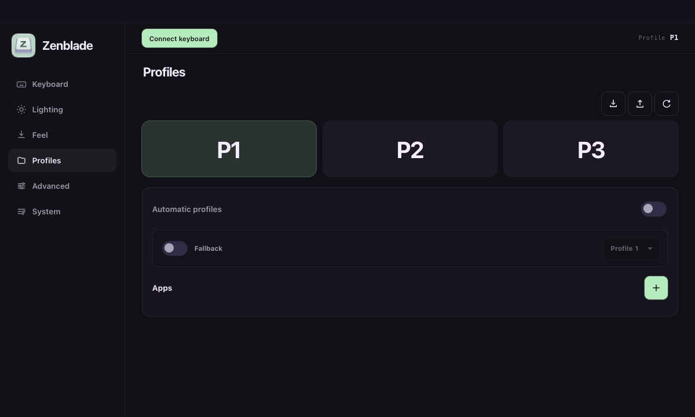
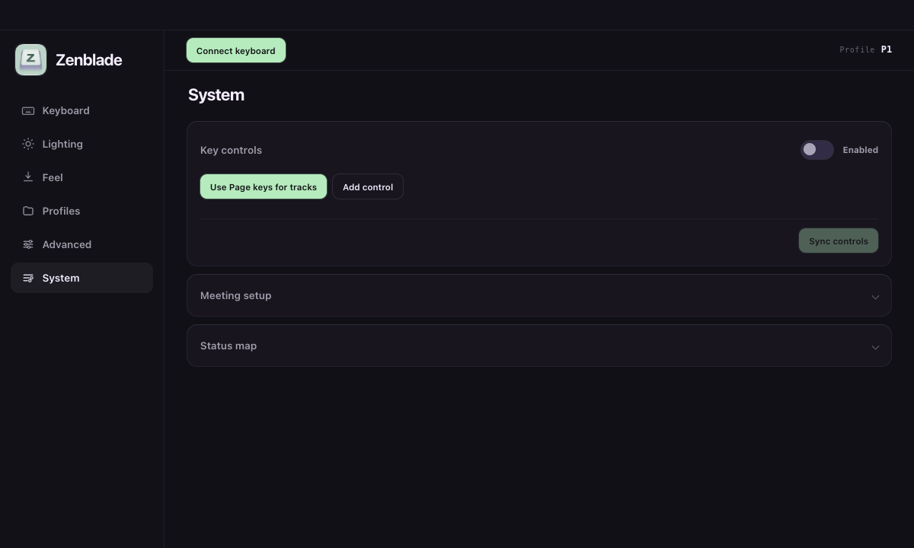

# Zenblade for macOS

A free, open-source controller for the **Pwnage Zenblade 65 V2**. Adjust your keyboard’s lighting, key response, and profiles directly from your Mac.

**[Download V0.1](https://edgetr.github.io/Zenblade-65-V2-MacOS-App/)** · [User guide](docs/USAGE.md) · [Report an issue](https://github.com/edgetr/Zenblade-65-V2-MacOS-App/issues)


## What it does

- **Lighting:** firmware effects, brightness, speed, color, and a live preview.
- **Key response:** global actuation, Rapid Trigger, and individual key overrides.
- **Profiles:** three independent setups, app-based switching, and import/export.
- **Onboard controls:** six remapping layers, SOCD pairs, and sixteen macro slots.
- **Mac controls:** media keys, microphone shortcuts, and audio device presets.
- **Menu bar:** switch profiles, toggle lighting, and reconnect without opening the window.

Settings remain editable while disconnected. System status maps are **app previews only**; the current firmware does not expose per-key RGB output.

## Install

1. Download **[Zenblade-0.1.0-arm64.dmg](https://github.com/edgetr/Zenblade-65-V2-MacOS-App/releases/download/v0.1/Zenblade-0.1.0-arm64.dmg)** from the release.
2. Open the DMG and drag **Zenblade** to **Applications**.
3. Try opening Zenblade. If macOS blocks it, go to **System Settings → Privacy & Security → Open Anyway**, then confirm **Open**. On macOS 12, use **System Preferences → Security & Privacy**.
4. Connect your keyboard over USB and select **Connect keyboard**.

**Requires an Apple-silicon Mac and macOS 12 or newer.** This release does not include an Intel build. Only the Zenblade 65 V2 is supported.

This community build is ad-hoc signed and **not notarized by Apple**. Only approve a download you trust. The release includes a SHA-256 checksum. [Apple’s first-launch guidance](https://support.apple.com/en-gb/102445).

No Node.js or developer tools are needed for the DMG. macOS 12 is the build target; this release was exercised on the maintainer’s current Mac, not every supported macOS version.

## A quieter workspace

The V0.1 interface keeps connection controls available across pages, removes repeated explanations, and puts advanced editors behind expandable sections.

### Lighting


### Profiles



### Mac controls



Screenshots show the packaged app in offline editing mode. See the [user guide](docs/USAGE.md) for setup and feature details.

## Build from source

Requires Node.js 22.12+ and Xcode 27 or newer on an Apple-silicon Mac. Full Xcode compiles the Icon Composer asset; running from source with `npm start` only needs Command Line Tools.

```bash
git clone https://github.com/edgetr/Zenblade-65-V2-MacOS-App.git
cd Zenblade-65-V2-MacOS-App
npm ci
npm test
npm run build
```

The app is written to `dist/mac-arm64/Zenblade.app`.

| Command | Purpose |
| --- | --- |
| `npm start` | Compile the native helper and run from source |
| `npm run dev` | Run with DevTools |
| `npm test` | Run model and protocol regression tests |
| `npm run build:icons` | Compile the native layered icon and older macOS fallback |
| `npm run build` | Build the Apple-silicon application |
| `npm run release:dmg` | Build, ad-hoc sign, and create the DMG and checksum |
| `npm run install-app` | Build, replace the local Applications copy, and open it |

[Architecture and contribution guide](docs/DEVELOPMENT.md) · [V0.1 release notes](docs/releases/v0.1.md)

## Review the code and give feedback

The complete source and [security notes](SECURITY.md) are public. Review them or [build from source](#build-from-source) if you prefer not to trust a prebuilt download. The release includes a checksum.

What would you like added? Leave a comment on the announcement or [open a feature request](https://github.com/edgetr/Zenblade-65-V2-MacOS-App/issues).

## Community project

Zenblade is independent and is not affiliated with or endorsed by Pwnage. Audio inspection, process matching, and profile settings stay local to your Mac.

To uninstall, quit Zenblade from its menu and remove `/Applications/Zenblade.app`. Saved settings remain in the app’s user-data directory unless removed separately.

[MIT License](LICENSE)
