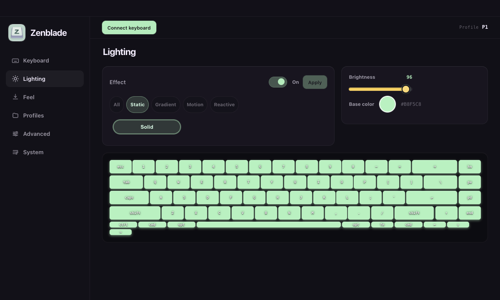
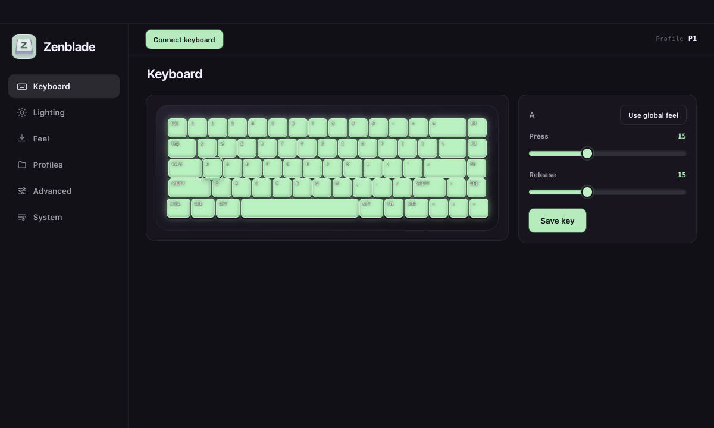
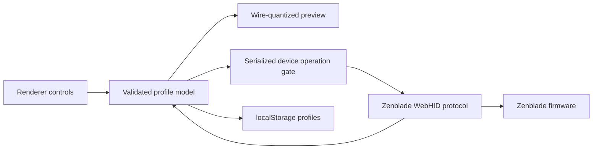

# Zenblade 65 V2 for macOS

A free, open-source macOS controller for the **Pwnage Zenblade 65 V2** keyboard. It provides native lighting, actuation, per-key override, and profile controls without requiring the Windows software.

> This is an independent community project and is not affiliated with or endorsed by Pwnage.



## Features

- Discover and connect supported Zenblade devices through WebHID.
- Select firmware lighting effects, power, brightness, speed, and base color.
- Preview lighting with the same 8-bit hue, saturation, and brightness conversions sent to the keyboard.
- Show the visible start and end colors for horizontal and vertical gradients.
- Configure global press/release points and Rapid Trigger.
- Save press/release overrides for individual keys.
- Verify the keyboard's fixed 8,000 Hz / 125 μs USB report interval.
- Remap all 68 keys across six onboard layers.
- Configure ten SOCD pairs independently for each hardware profile.
- Record and edit sixteen onboard macro slots using the keyboard.
- Turn Home, Page Up, Page Down, or End into onboard media controls per profile, or preserve the key and bind a modifier combination.
- Switch macOS audio inputs and outputs, toggle microphone mute, and apply a profile-specific meeting setup from keyboard bindings.
- Build configurable microphone and process-aware status maps with editable colors, priorities, keys, and animated activity rows.
- Keep three local profiles with independent lighting, feel, and per-key settings.
- Switch profiles automatically for applications chosen by the user.
- Control profiles, lighting, and reconnect from the macOS menu bar.
- Import and export validated profile files for backup or sharing.
- Reconnect and restore state after USB changes, sleep, wake, and screen unlock.
- Browse and edit local settings while the keyboard is disconnected.
- Restore locally saved actuation settings when reconnecting.



The preview represents the exact digital values sent by the app. A monitor and physical LEDs have different color gamuts and calibration, so perfect colorimetric matching between them is not possible.

## Requirements

- An Apple-silicon Mac.
- A recent macOS release.
- Node.js 22.12 or newer (the current LTS release is recommended).
- Xcode Command Line Tools for compiling the small native CoreAudio bridge.
- A Pwnage Zenblade 65 V2 connected over USB.

The HID filters currently accept vendor ID `0x3662` with product IDs `0x1001` and `0x1002`. Unsupported keyboards are not selected automatically.

## Install in Applications

Clone or download the repository, open Terminal in the project directory, and run:

```bash
npm run install-app
```

The installer performs a fresh build, creates a local ad-hoc signature, verifies the bundle, replaces `/Applications/Zenblade.app`, and opens it. Run the same command after pulling future updates.

On first use, select **Choose keyboard**, then choose the filtered Zenblade in the macOS device picker. Subsequent launches normally reconnect automatically. Use **Device → Reconnect**, the menu-bar controller, or the **Refresh** button if needed.

## Build from source

```bash
git clone https://github.com/edgetr/Zenblade-65-V2-MacOS-App.git
cd Zenblade-65-V2-MacOS-App
npm ci
npm test
npm run build
```

The unpacked application is written to:

```text
dist/mac-arm64/Zenblade.app
```

To run directly from the source tree:

```bash
npm start
```

For development with detached Chromium DevTools:

```bash
npm run dev
```

## Using the app

### Lights

1. Choose an effect category and firmware effect.
2. Adjust the controls exposed by that effect.
3. Use the circular color picker for effects that accept a base color.
4. For **Gradient V** and **Gradient H**, check the two endpoint swatches against the keyboard preview.
5. Select **Apply** to write the settings to the keyboard.

The app intentionally omits firmware mode `2` (`Alpha Mods`) because it is not supported by this keyboard. Stored or reported mode-2 values safely fall back to **Solid**; the remaining firmware IDs are not renumbered.

### Feel

- **Press** controls how far a key travels before registering.
- **Release** controls how far it must return before unregistering.
- **Rapid Trigger** allows a key to retrigger as soon as its direction changes.
- **Snappy**, **Balanced**, and **Typing** provide starting points.
- **Apply** writes the complete actuation matrix to the current keyboard profile.

### Keyboard

Select a key in the keyboard diagram to set a press/release override. **Save Key** stores the change locally while disconnected; **Apply Key** stores it and writes the current matrix when connected. **Reset Key** returns it to the profile's global Feel values.

### Profiles

Profiles 1–3 keep separate lighting, Feel, and per-key settings. Switching profiles writes the selected profile and attempts to apply all of its settings. If only part of that operation succeeds, the Profiles page offers a recovery action.

Use **Export** to save the current profile as a `.zenbladeprofile` file. **Import** validates a profile file, confirms before replacing the current local profile, and applies it when the keyboard is connected.

### Advanced

Select **Load keyboard** before editing advanced controls. This reads the real onboard configuration instead of assuming defaults.

- **Polling rate** reports the 125 μs USB interval advertised by the connected V2, which is 8,000 Hz. The current firmware does not expose a polling-rate setter, so the app does not show a control that cannot affect the hardware.
- **Key remapping** edits one physical key on one of the six hardware layers. Escape remains protected because the firmware rejects remapping it.
- **SOCD pairs** provides ten slots per hardware profile with last-input, neutral, and dominant-key rules.
- **Macros** loads all sixteen hardware slots. Select **Record**, type the sequence, and press Escape or select **Stop recording**. Delays and ASCII text can also be added directly.

Every advanced save reads the setting back from the keyboard and reports an error if the stored data does not match.

### System

The **System** page links spare keyboard keys to macOS without introducing an arbitrary script runner.

- **Key controls** offers two trigger styles. **Replace a key** turns Home, Page Up, Page Down, or End into the selected function; media functions use verified onboard keycodes, so playback and volume work without the app window. **Modifier + key** preserves the factory key and runs a desktop action such as Command+Home → microphone toggle while the keyboard is connected and Zenblade is running in the background. One binding may own each spare key, preventing ambiguous overlaps.
- **Meeting setup** stores an input and output device independently for each profile. It is configuration only: map Meeting setup, Select microphone, or Select audio output to a keyboard binding to invoke it.
- **Status map** watches microphone mute state or a user-supplied process-name fragment. Rules choose their own color, key or activity row, and priority. Mic and action rules may intentionally share a key because input mappings and status colors are separate layers.
- **Quick presets** provide editable starting points for muted microphone, Codex, Claude Code, and Grok. They are ordinary rules after creation: names, process matches, targets, priorities, and colors remain fully customizable.

The Zenblade V2 firmware currently exposes whole-board lighting parameters but no per-key RGB framebuffer. The app therefore renders status rules in its live keyboard map and never replaces the physical keyboard’s selected lighting effect with a misleading whole-board color. The status engine and rendering output are isolated so a future verified per-key protocol or firmware can drive the same rules physically.

System controls and indicators are stored inside each Zenblade profile and are included in profile exports. Pausing controls or removing a replacement restores Home, Page Up, Page Down, and End to their factory functions the next time controls are synced; modifier shortcuts are unregistered. Process matching and audio inspection remain entirely local to the Mac.

### Automatic switching

Automatic switching starts with no application rules. In **Profiles**:

1. Select **Add applications** and choose one or more installed Mac apps.
2. Choose the profile each application should activate.
3. Optionally enable a fallback profile for every application without a rule.
4. Turn **Automatic switching** on.

Rules match exact macOS bundle identifiers; the app does not assume or hardcode games, editors, or other applications. Turn the feature off from either the Profiles page or the menu-bar controller to pause switching without deleting rules.

### Menu bar and reconnect recovery

Zenblade remains available from the macOS menu bar when its window is closed. The menu provides the current connection state, Profile 1–3, lighting power, automatic switching, reconnect, and a shortcut back to the main window.

After sleep, wake, unlock, or a supported keyboard reconnect, the app reuses the existing WebHID permission and restores the current profile without opening a new device chooser. If the keyboard is unavailable, local settings remain intact and **Choose keyboard** stays available.

## Architecture

Zenblade is a small Electron application with no renderer framework or production runtime dependencies.

| Area | Main files | Responsibility |
| --- | --- | --- |
| Electron host | `electron/main.js`, `electron/preload.js`, `electron/desktop.js`, `electron/system-bridge.js` | Window/tray lifecycle, foreground-app metadata, local process matching, native audio routing, file dialogs, power events, macOS menu, HID permission bridge |
| Native macOS bridge | `native/zenbridge.m`, `scripts/build-native.sh` | CoreAudio device discovery/default routing and microphone mute without shell interpolation or third-party runtime dependencies |
| App orchestration | `renderer/js/app.js`, `renderer/js/bootstrap-ui.js`, `renderer/js/desktop-controller.js` | Connect/recovery flow, app-aware switching, tray state, operation gating, navigation, top-level UI synchronization |
| HID protocol | `renderer/js/protocol.js`, `shared/device-ids.json` | Device filtering, command queue, 8 × 9 matrix packing, lighting/profile/actuation, remapping, SOCD, and macro reads/writes |
| State and persistence | `renderer/js/state.js`, `renderer/js/store.js` | Profile model, validation, migration, debounced `localStorage` persistence |
| Lighting | `renderer/js/lighting-modes.js`, `lighting-ui.js`, `lighting-preview.js`, `preview.js` | Fixed firmware IDs, control visibility, wire-quantized colors, effect preview recipes |
| Keyboard and feel | `renderer/js/board.js`, `key-editor.js`, `layout.js`, `device-ops.js` | 68-key layout, responsive rendering, per-key overrides, full 72-cell firmware matrices |
| Advanced controls | `renderer/js/advanced-ui.js`, `advanced-data.js` | Keyboard-first remapping, SOCD pairs, macro recording, and hardware read-back verification |
| System controls | `renderer/js/system-ui.js`, `system-data.js` | Per-profile media mappings, audio scenes, process/microphone context, status composition, and deterministic key restoration |
| Presentation | `renderer/index.html`, `renderer/css/` | Accessible semantic controls and native macOS-oriented visual styling |
| Tests | `test/model.test.js` | Model boundaries, HID packing/matching, mode integrity, preview behavior, regressions |


```mermaid
flowchart LR
  UI[Renderer controls] --> Model[Validated profile model]
  Model --> Preview[Wire-quantized preview]
  Model --> Gate[Serialized device operation gate]
  Gate --> HID[Zenblade WebHID protocol]
  HID --> Keyboard[Zenblade firmware]
  HID --> Model
  Model --> Storage[localStorage profiles]
```

### Important invariants for contributors and coding agents

- Lighting firmware IDs are wire values. Never renumber them when hiding an unsupported UI option.
- Lighting writes intentionally send both command families `7` and `9` for v1/v2 and v3 compatibility.
- Rich HID responses must match the complete command prefix; matching only the first byte can resolve the wrong queued command.
- Actuation writes translate 68 logical keys into the firmware's full 72-cell matrix. Preserve `LOGICAL_MATRIX_POSITIONS`, `CODE_TO_MATRIX_INDEX`, and their round-trip tests.
- Keep hardware work inside `DeviceOperationGate` so overlapping writes cannot corrupt the command queue.
- Keep System key ownership limited to Home/Page Up/Page Down/End, and restore all four deterministically when the feature is paused.
- Do not claim physical per-key status lighting unless a verified framebuffer protocol is added. Whole-board color replacement is not an acceptable fallback.
- Keep `contextIsolation` enabled, renderer Node integration disabled, and HID permissions narrowly scoped.
- Previews should use the same wire conversions as device writes. Do not add cosmetic brightness floors or color whitening to the key fill.
- Preserve unknown legacy profile fields when practical so upgrades do not destroy local user data.

## Making changes

Before opening a pull request or handing a branch back to another agent:

```bash
git diff --check
npm test
npm run build
```

For UI changes, also install the build locally and inspect every affected page at the minimum supported window size. For protocol changes, test with a real keyboard and keep packets or reproducible observations with the change description.

An effective prompt for a coding agent should point it to this Architecture section, name the relevant subsystem, state whether hardware behavior may change, and require tests plus a build. Avoid asking an agent to guess new firmware IDs or effects without device evidence.

## Project scripts

| Command | Purpose |
| --- | --- |
| `npm test` | Run the Node test suite |
| `npm start` | Compile the native bridge and run the app from source |
| `npm run dev` | Compile the native bridge and run from source with DevTools |
| `npm run build:native` | Compile the arm64 CoreAudio helper |
| `npm run build` | Build the unpacked Apple-silicon app |
| `npm run install-app` | Build, sign, install, and open `/Applications/Zenblade.app` |

## Uninstall

Delete `/Applications/Zenblade.app`. Local profiles are stored in Electron's application data directory and can be removed separately if you also want to reset saved settings.

## License

[MIT](LICENSE) — use, study, modify, and redistribute the source for personal or community projects.
