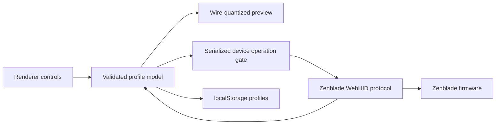

# Architecture and contributing

Zenblade is a small Electron application with no renderer framework or production runtime dependencies.

| Area | Main files | Responsibility |
| --- | --- | --- |
| Electron host | `electron/main.js`, `electron/security.js`, `electron/preload.js`, `electron/desktop.js`, `electron/system-bridge.js` | Window/tray lifecycle, foreground-app metadata, local process matching, native audio routing, file dialogs, power events, macOS menu, HID permission bridge |
| Native macOS bridge | `native/zenbridge.m`, `scripts/build-native.sh` | CoreAudio device discovery/default routing and microphone mute without shell interpolation or third-party runtime dependencies |
| App orchestration | `renderer/js/app.js`, `renderer/js/bootstrap-ui.js`, `renderer/js/desktop-controller.js` | Connect/recovery flow, app-aware switching, tray state, operation gating, navigation, top-level UI synchronization |
| HID protocol | `renderer/js/protocol.js`, `shared/device-ids.json` | Device filtering, command queue, 8 × 9 matrix packing, lighting/profile/actuation, remapping, SOCD, and macro reads/writes |
| State and persistence | `renderer/js/state.js`, `renderer/js/store.js` | Profile model, validation, migration, debounced `localStorage` persistence |
| Lighting | `renderer/js/lighting-modes.js`, `lighting-ui.js`, `lighting-preview.js`, `preview.js` | Fixed firmware IDs, control visibility, wire-quantized colors, effect preview recipes |
| Keyboard and feel | `renderer/js/board.js`, `key-editor.js`, `layout.js`, `device-ops.js` | 68-key layout, responsive rendering, per-key overrides, full 72-cell firmware matrices |
| Advanced controls | `renderer/js/advanced-ui.js`, `advanced-data.js` | Keyboard-first remapping, SOCD pairs, macro recording, and hardware read-back verification |
| System controls | `renderer/js/system-ui.js`, `system-data.js` | Per-profile media mappings, audio scenes, process/microphone context, status composition, and deterministic key restoration |
| Presentation | `renderer/index.html`, `renderer/css/` | Accessible semantic controls and native macOS-oriented visual styling |
| Tests | `test/*.test.js` | Model boundaries, HID packing/matching, mode integrity, preview behavior, regressions |



### Important invariants for contributors and coding agents

- Lighting firmware IDs are wire values. Never renumber them when hiding an unsupported UI option.
- Lighting writes intentionally send both command families `7` and `9` for v1/v2 and v3 compatibility.
- Rich HID responses must match the complete command prefix; matching only the first byte can resolve the wrong queued command.
- Actuation writes translate 68 logical keys into the firmware's full 72-cell matrix. Preserve `LOGICAL_MATRIX_POSITIONS`, `CODE_TO_MATRIX_INDEX`, and their round-trip tests.
- Keep hardware work inside `DeviceOperationGate` so overlapping writes cannot corrupt the command queue.
- Keep System key ownership limited to Home/Page Up/Page Down/End, and restore all four deterministically when the feature is paused.
- Do not claim physical per-key status lighting unless a verified framebuffer protocol is added. Whole-board color replacement is not an acceptable fallback.
- Keep the renderer sandbox and `contextIsolation` enabled, renderer Node integration disabled, and IPC/HID permissions narrowly scoped. The CSP must allow bundled JSON module imports (`connect-src 'self'`).
- Previews should use the same wire conversions as device writes. Do not add cosmetic brightness floors or color whitening to the key fill.
- Preserve unknown legacy profile fields when practical so upgrades do not destroy local user data.

## Making changes

Before opening a pull request or handing a branch back to another agent:

```bash
git diff --check
npm test
npm run build
```

For UI changes, also launch the packaged build with a separate user-data directory and inspect every affected page at the minimum supported window size. For protocol changes, test with a real keyboard and keep packets or reproducible observations with the change description.

An effective prompt for a coding agent should point it to this Architecture section, name the relevant subsystem, state whether hardware behavior may change, and require tests plus a build. Avoid asking an agent to guess new firmware IDs or effects without device evidence.


## Release artwork and local preview

The DMG layout is configured in `package.json` under `build.dmg`. `build/dmg-background.svg` is the editable artwork source; the adjacent 1x and 2x PNG files are bundled by the packager for Retina displays.

After `npm run release:dmg`, run `npm run preview:release` to serve the DMG from `http://127.0.0.1:8765`. This is a local review page; it does not upload or publish anything. Stop it with Control-C when testing is finished.

The app icon is an editable Icon Composer document at `build/icon-source/Zenblade.icon`. It contains three original SVG layers, with material settings authored and reviewed in Icon Composer. The neighboring PNG is its static UI export. After changing the design, export the default appearance at 1024px and refresh `build/icon.png` and the renderer icon sizes.

`npm run build:icons` uses Xcode 27+ `actool` to produce `build/Assets.car` and `build/icon.icns`. Apple’s compiler supplies the macOS icon margins and legacy raster sizes. The app bundles the catalog with `CFBundleIconName = Zenblade`; packaged builds must not replace the Dock icon with `app.dock.setIcon`, which would discard native material and appearance support.
